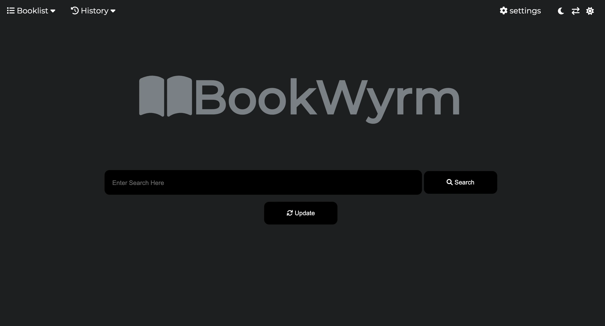
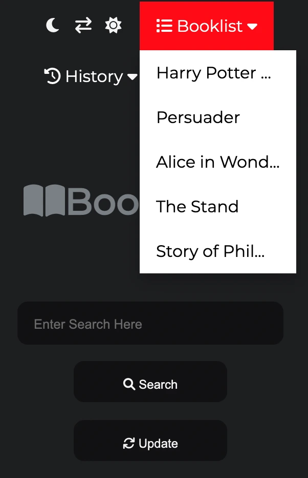
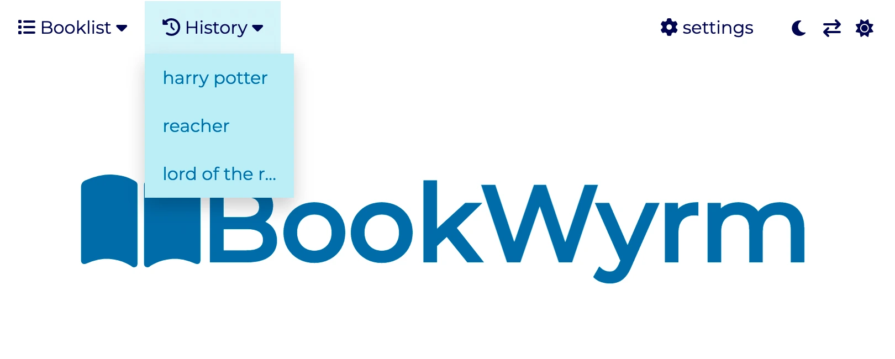
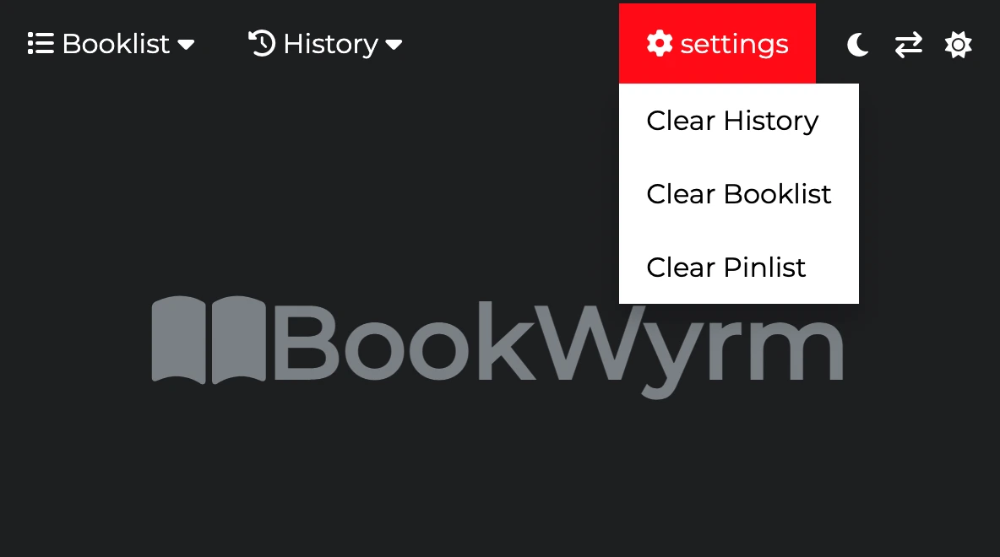
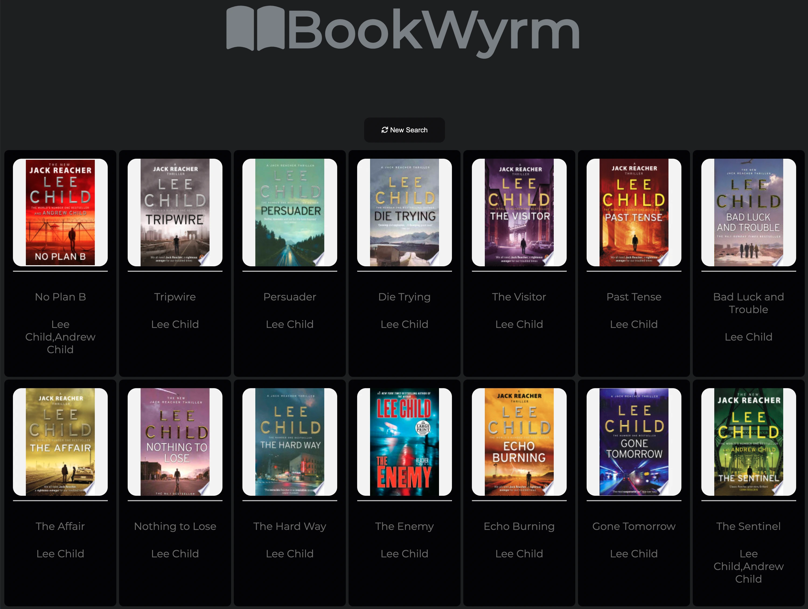
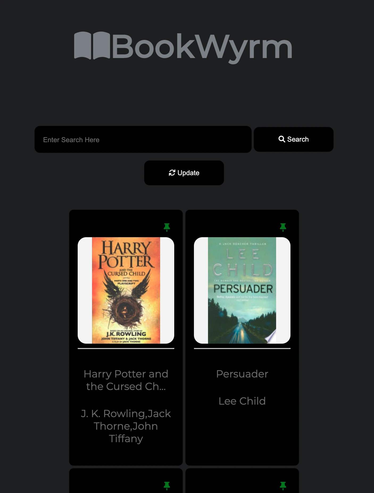
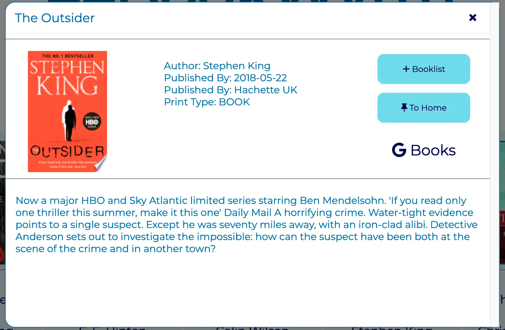
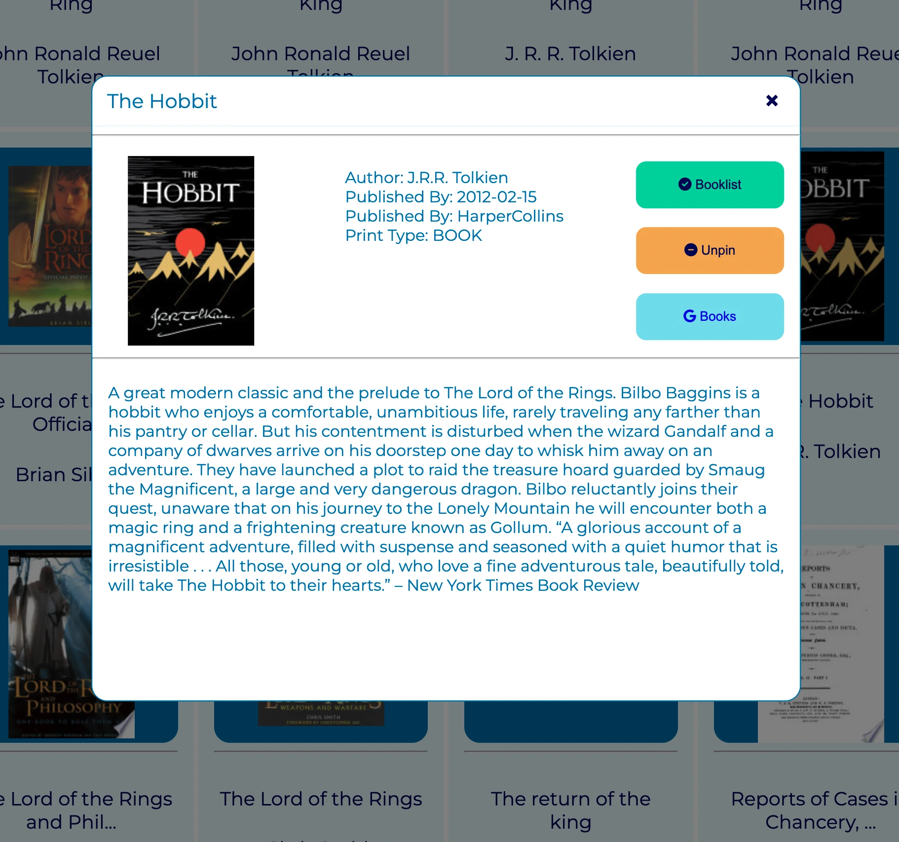

# BookWyrm

[View the Live Project](https://radheyam.github.io/BookWyrm/)

## Overview

BookWyrm is a book finder site enabling a user to send queries to the Google Books API and recieve responses in the form of cards.  On receiving the search results the user can expand a modal, or popup window, by clicking a card to get more information on a given book, they can also save it to a booklist, pin it to their home page or visit the Google Books page for that book via buttons in the modal. 

Why not just use Google Books? Although Google Books itself is an excellent platform, BookWyrm does particularly well in displaying the search results in cards that can be seen at a glance, and instead of clicking each link and opening a new page to get more info on the book, you can access the info on the same page with a click.  It's specifically designed for quick searches, which you can save or pin to your homescreen.  BookWyrm is targeted towards users looking for this feature set, and of course users who simply find the interface subjectively more congenial than Google Books.

## Table of Contents
+ [Planning](#planning)
+ [Development](#development)
+ [Features](#features)
  - [Home Page](#homepage)

+ [Technologies Used](#technologies-used)
+ [Testing](#testing)
+ [Deployment](#deployment)
+ [Credits](#credits)

## Planning

## Development

## Features
[Comprehensive selection of feature images](documents/feature-images/)
### Homepage
#### Search Bar 
A search can be initiated by clicking the search button or by pressing enter when the search bar is active.  Any term can be searched, title, author etc.
#### Update Button 
The update button refreshes the booklist and pinned cards if any changes made.  In the search results window the button text changes to "New Search", which takes the user back to the homepage and also refreshes the lists if any changes were made.
All interactive buttons and cards on the site have a responsive animation on hover to give feedback to user actions and increase user engagement and engender positive emotion throughout.

### Header
There are four options in the header, three dropdown menus and a theme toggle.  The dropdown list items character lengh is limited to avoid massive menus.

#### Booklist
On hovering with the mouse a dropdown of the users saved books appears.  On clicking with the mouse a popup window opens for that specific title.

#### History
Shows the last ten searches.  On clicking an item the user can re-initiate a search for that term.

#### Settings 
Three options are available to the user.  The ability to clear the history, booklist and pinned cards memory.  The user is prompted to confirm twice to make sure they want to clear that information.

#### Theme Toggle 
On clicking the theme can be toggled between dark and light mode, and user selection will be remembered after refresh.
### Search Results
On initiating a search the search bar and header are hidden.  This is to avoid any issues with multiple search results in the same window and so that any changes to lists made by the 
user can be updated smoothly before the lists can be accessed.

### Cards
The results of a search are returned in card form with an image of the book, the title and the author(s). A placeholder image is supplied if the API object does not contain an image link.  If the user wants more info on the book they can click anywhere on the card to open a popup window.

### Pinned Cards
Books pinned by the user are displayed below the search bar in card form, with a green pin in the corner.  On clicking the card a popup window with details appears.

### Popup (Modal) Window
On clicking a card or an item in the booklist a popup window is displayed containing the following
The title of the book is displayed top left, picture of the cover below, some details concerning the book are displayed in the center and to the right are three interactive buttons providing the user with a variety of options.  The rest of the card contains a description as provided by the API.
There are two ways to close the popup, an 'X' beside the title or by clicking outside the popup on the overlay background.
The popup reshapes itself according to the size of the screen, and if there is overflow a scroll bar appears.

### Popup Buttons
the popup contains three interactive buttons, the first two of which have varying functions depending on whether the book blongs to a user list or not.  Should they belong to a list they change color and text accordingly.  When clicked to add they will turn green and text changes.  If the popup for the same book is opened again the button will be yellow and text giving the user the option of removing the book and also indicating which list it already belongs to.  On clicking remove the text changes again confirming the action.
"To Booklist" adds a book, "Pin To Home" generates a card on page reload and "Google Books" takes the user to the google books page for the specific book.

### Footer
A footer was not included as it was deemed unnecessary.

## Technologies Used

## Testing

## Deployment

## Credits