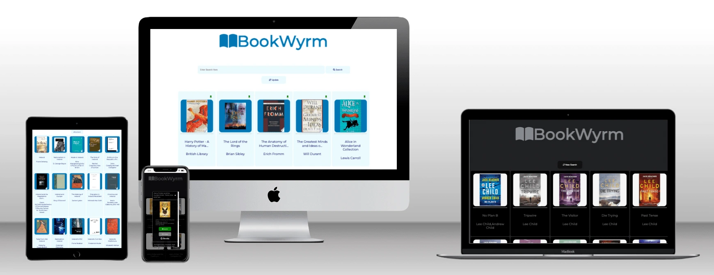
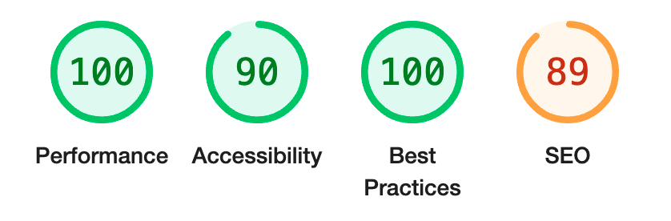
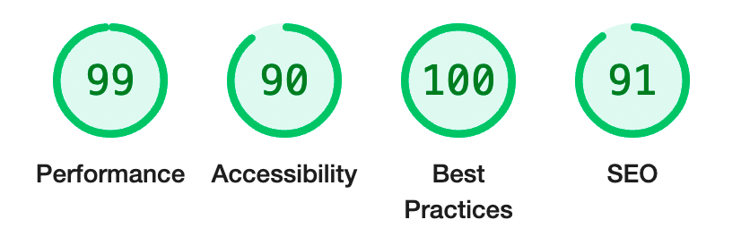

# BookWyrm

[View the Live Project](https://radheyam.github.io/BookWyrm/)

## Overview

BookWyrm is a book finder site enabling a user to send queries to the Google Books API and recieve responses in the form of cards.  On receiving the search results the user can expand a modal, or popup window, by clicking a card to get more information on a given book, they can also save it to a booklist, pin it to their home page or visit the Google Books page for that book via buttons in the modal. 

Why not just use Google Books? Although Google Books itself is an excellent platform, BookWyrm does particularly well in displaying the search results in cards that can be seen at a glance, and instead of clicking each link and opening a new page to get more info on the book, you can access the info on the same page with a click.  It's specifically designed for quick searches, which you can save or pin to your homescreen.  BookWyrm is targeted towards users looking for this feature set, and of course users who simply find the interface subjectively more congenial than Google Books.

## Table of Contents
+ [Planning](#planning)
+ [Development](#development)
+ [Features](#features)
  - [Home Page](#homepage)

+ [Technologies Used](#technologies-used)
+ [Testing](#testing)
+ [Deployment](#deployment)
+ [Credits](#credits)

## Planning

## Development

## Features
[Comprehensive selection of feature images](documents/feature-images/)
### Homepage
#### Search Bar 
A search can be initiated by clicking the search button or by pressing enter when the search bar is active.  Any term can be searched, title, author etc.
#### Update Button 
The update button refreshes the booklist and pinned cards if any changes were made.  In the search results window the button text changes to "New Search", which takes the user back to the homepage and also refreshes the lists if any changes were made.

### Header
There are four options in the header, three dropdown menus and a theme toggle.  The dropdown list items character length is limited to avoid massive menus.

#### Booklist
On hovering with the mouse a dropdown of the users saved books appears.  On clicking with the mouse a popup window opens for that specific title.

#### History
Shows the last ten searches.  On clicking an item the user can re-initiate a search for that term.

#### Settings 
Three options are available to the user.  The ability to clear the history, booklist and pinned cards memory.  The user is prompted to confirm twice to make sure they want to clear that information.

#### Theme Toggle 
On clicking, the theme can be toggled between dark and light mode and the user selection will be remembered after refresh.
### Search Results
On initiating a search the search bar and header are hidden.  This is to avoid any issues with multiple search results in the same window and so that any changes to lists made by the 
user can be updated smoothly before the lists can be accessed.

### Cards
The results of a search are returned in card form with an image of the book, the title and the author(s). A placeholder image is supplied if the API object does not contain an image link.  If the user wants more info on the book they can click anywhere on the card to open a popup window.

### Pinned Cards
Books pinned by the user are displayed below the search bar in card form with a green pin in the corner.  On clicking the card a popup window with details appears.

### Popup Window (Modal)
The popup is accessed by clicking a card or an item in the booklist.  On opening the user receives more information concerning the book and gains access to actions through the two buttons and external link described below.

### Popup Buttons
The popup contains two interactive buttons, which have varying functions depending on whether the book belongs to a user list or not, and the color and text also change accordingly providing satisfying feedback and useful information to the user.

### Footer
A footer was not included as it was deemed unnecessary.

## Technologies Used

## Testing

### JSHint - JavaScript Code Validator

Three warnings - not serious:

  - async functions only available in ES8.  No issues were detected in performance across devices due to this issue.
  - Two of the same issue, functions declared inside of a loop warning.  This could be improved for readability but they are simple functions and are annotated accordingly but going forward this advice will be followed.

  - [JSHint Test Configurations](documents/testing/validator-results/jshint/jshint-configs.png)
  - [JSHint Test Feedback Results](documents/testing/validator-results/jshint/jshint-results.png)

### W3C CSS Validator

This document validates as CSS level 3 + SVG.
  - [Results](documents/testing/validator-results/css-w3c-validator.pdf)

### W3C Nu HTML Validator

Passed with no errors or warnings to show.
  - [Results](documents/testing/validator-results/nu-html-w3c-validator.pdf)

### Lighthouse - Google Developer Tools
Accessibility
  - the score is decreased due to the buttons not having a name, however it is part of the design of the theme toggle button to be just icons and the popup buttons innerHTML will be populated by JavaScript.

SEO
  - There are some errors here beyond the scope of the course to fix.

Included in the link below are test results initial and after the fixes showing improvements.

[Lighthouse Report Results](documents/testing/lighthouse/)

#### Desktop

#### Mobile

### Known Bugs To Be Fixed
#### Firefox and iOS Devices
The event listener to open popups relies on event.path to identify which book information to use in populating a popup window.  The event.path synthax is not supported on iOS touchscreen devices or on the Firefox browser and as a result the popups cannot be opened when using these technologies.  An attempt was made to rectify the issue but as the bug was discovered late in development there was insufficient time available to rectify it before the deadline.

#### Favicon Error
An error pops up in the console on loading the site linked to favicon.ico, but as it does not seem to affect performance in any way it was not addressed due to more important issues.

#### Missing API Info
There is a placeholder image supplied for cards when the API data is missing image links, but it does not transfer onto the popup. With an indepth look at the logic defining the image path this issue can be fixed.
Furthermore, sometimes other information is missing from particular books and is displayed as "undefined".  To be fixed by adding logic to replace undefined with a message explaining the issue to the user.

#### Removing Book Without Refresh
If a book is removed from the booklist or pinned cards memory on the home screen, it will still be visible but will not open a popup upon click.  Only removed upon window refresh.  This should be realitively easy to fix by adding a hidden class to the elements involved. 

#### Book Titles 
If the user attempts to add a book with the same title as a book already in a list, nothing new will be added.  To fix, logic checking for more than just the title when blocking duplicate entries can be written.

## Deployment
Within the Github respository window select the 'settings' tab menu and navigate to 'pages'. Select 'Branch: main' from the dropdown menu and execute. The site will be live in a matter of minutes, and the live URL will be displayed on the same deployment page. Any changes made after deployment in the main branch will be added to the live site after they are committed and pushed to the Github repository.

## Credits