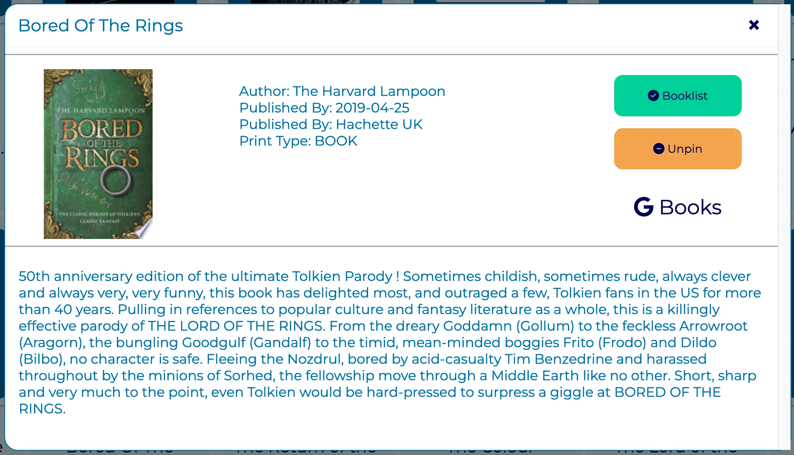

# BookWyrm

[View the Live Project](https://radheyam.github.io/BookWyrm/)

## Overview

BookWyrm is a single page book finder site enabling users to send queries to the Google Books API and recieve responses in the form of cards.  On receiving the search results the user can expand a pop-up window by clicking a card to get more information on a given book. They can also save it to a booklist, pin it to their home page or visit the Google Books page for that book via buttons in the modal. 

Why not just use Google Books? Although Google Books itself is an excellent platform, BookWyrm does particularly well in displaying the search results in cards that can be seen at a glance, and instead of opening each link in a new window, you can access the info on the same page with a click.  

## Table of Contents
+ [Planning](#planning)
  - [Target Users](#target-users)
  - [User Stories](#user-stories)
  - [Site Goals](#site-goals)
  - [Font and Color Scheme](#font-and-color-scheme)
+ [Features](#features)
  - [Search Section](#search-section)
  - [Header](#header)
  - [Search Results](#search-results)
  - [Cards](#cards)
  - [Pinned Cards](#pinned-cards)
  - [Popup Window (Modal)](#popup-window-modal)
  - [Popup Buttons](#popup-buttons)
  - [Desirable Improvements](#desirable-improvements)
+ [Functionality Overview](#functionality-overview)
  - [Querying](#querying)
  - [Local Storage](#local-storage)
  - [Populating HTML](#populating-html-from-local-storage)
  - [Popup Buttons](#popup-buttons-1)
  - [Event Listeners](#event-listeners)
+ [Technologies Used](#technologies-used)
+ [Testing](#testing)
  - [JavaScript Validation](#jshint---javascript-code-validator)
  - [CSS Validation](#w3c-css-validator)
  - [HTML Validation](#w3c-nu-html-validator)
  - [Lighthouse](#lighthouse---google-developer-tools)
  - [Adaptability and Responsiveness](#adaptability)
  - [Known Bugs](#known-bugs-to-be-fixed)
+ [Deployment](#deployment)
+ [Credits](#credits)

## Planning

### Target Users
- Students.
- Avid Readers.
- Researchers.
- Anyone searching for books who prefers the UI over Google Books.

### User Stories
What I want as a user from a book finder site:

- to be able to search for books quickly.
- to get the results back with relevant information.
- to be able to access more detailed information easily.
- to be able to save books for later in a list.
- to be able to save books in a visual list of cards on the homepage.
- to see a recent search history.
- to be able to choose between a dark or light theme.
- to be able to clear my lists and history.

### Site Goals
The site aims to be:

- Clean, simple and fast.
- Visually attractive with a smooth and intuitive UI.
- Responsive to user input and where possible providing reinforcing feedback to any action performed.
- Consistent in delivering the features promised.

### Font and Color Scheme
The font will be Montserrat from Google Fonts.  

The primary color scheme will be black with white text, which tends to be less straining on the eyes than a brighter theme.  There will however be a secondary light theme, which the user will be able to toggle to their preference.

## Features
[Comprehensive selection of feature images](documents/feature-images/)
### Search Section
#### Search Bar 
A search can be initiated by clicking the search button or by pressing enter when the search bar is active.  Any term can be searched, title, author etc.
#### Update Button 
The update button refreshes the booklist and pinned cards if any changes were made.  In the search results window the button text changes to "New Search" taking the user back to the homepage and also refreshing the lists if any changes were made.

### Header
There are four options in the header, three dropdown menus and a theme toggle.  The dropdown list items character length is limited to avoid massive menus.

#### Booklist
On hovering with the mouse a dropdown of the users saved books appears.  On clicking with the mouse a popup window opens for that specific title.

#### History
Shows the last ten searches.  On clicking an item the user can re-initiate a search for that term.

#### Settings 
Three options are available to the user.  The ability to clear the history, booklist and pinned cards memory.  The user is prompted to confirm twice to make sure they want to clear that information.

#### Theme Toggle 
On clicking, the theme can be toggled between dark and light mode and the user selection will be remembered after refresh.
### Search Results
On initiating a search the search bar and header are hidden.  This is to avoid any issues with multiple search results in the same window and so that any changes to lists made by the 
user can be updated smoothly before the lists can be accessed again.

### Cards
The results of a search are returned in card form with an image of the book, the title and the author(s). A placeholder image is supplied if the API object does not contain an image link.  If the user wants more info on the book they can click anywhere on the card to open a popup window.

### Pinned Cards
Books pinned by the user are displayed below the search bar in card form with a green pin in the corner.  On clicking the card a popup window with details appears.

### Popup Window (Modal)
The popup is accessed by clicking a card or an item in the booklist.  On opening the user receives more information concerning the book and gains access to actions through the two buttons and external link described below.

### Popup Buttons
The popup contains two interactive buttons, which have varying functions depending on whether the book belongs to a user list or not, and the color and text also change accordingly providing satisfying feedback and useful information to the user.

### Footer
A footer was deemed unnecessary to the minimalist design of the site.

### Desirable Improvements
  - A'help' setting, when clicked the user can hover over a feature and get an explanation dialogue box.
  - Customisable lists that a user can create and name themselves.
  - Lists in a sidebar rather than a dropdown.
  - The ability to add and remove list items directly from the cards.
  - The ability to delete single items in the dropdown menus.

### Abandoned Features
  - More detailed searches for a specific author or genre.  Although this sounds and looks good, it's unnecessary as the general search is more than adequate no matter the term.  It was also very complicated to generate a URL taking certain terms, not worth the effort.

## Functionality Overview

This section aims to clarify the general working of the code, giving an insight into how the features work behind the scenes to anyone reviewing indepth.

### Querying
Fundamentally the site is a GUI to query the Google Books API.  An asyncronous function generates a query URL based on user search input and stores the response JSON data in local storage.

### Local Storage
Local storage is relied upon for all the main features of the site.  
-  Saving the response data which is then used to populate the cards.
-  Saving the search history.
-  Saving data related to books saved by the user in the booklist and pinned cards list.
-  There are two local storage arrays for each list, one for the complete book JSON object retrieved and then saved by the user and the other saves just the title information.  As they are saved at the same time the ordering of the arrays always matches.
-  Saving the user theme choice.

### Populating HTML from Local Storage
-  HTML Templates are used to generate cards containing specific information from the response data.
-  The popup is not a template, but the same code re-populated each time it's opened.  It can be populated from three different local storage arrays depending on where it's triggered by the user.
-  The booklist and history dropdown menus are populated by generating new HTML list links when added.
-  The specific book used to populate a given popup is chosen by a data variable ID which is set when the card is generated, using this it is able to find the specific book in the relevant local storage array.

### Popup Buttons
-  The popup buttons are adaptable to where certain book information is stored.  When the popup is generated JavaScript code looks through the local storage to check if the book is stored or not and the particular status is reflected in how the button appears to the user.

### Event Listeners
- On load event listeners are used to populate or update the local storage lists each time the site is reloaded.
- Click event listeners combined with event.path is used to identify the particular book ID in storage.
- Refreshing the page after user input is quite important and influenced the design of the site to facilitate mandatory refreshes where possible. There is also an update button to refresh the homepage after making changes to the lists as they don't update without a page refresh.

## Technologies Used

- HTML5
- CSS3
- JavaScript
- [Google Books API](https://developers.google.com/books/docs/v1/using) - all information returned on a search.
- [Git](https://git-scm.com/) - for version control.
- [Github](https://github.com/) - repository to store the project files and host/share the project.
- [Gitpod](https://gitpod.io/) - browser IDE used to write the project code.
- [Convertio](https://convertio.co/jpg-webp/) - used to convert jpg images to better optimised webp format.
- [Optimizilla](https://imagecompressor.com/) - used to optimise the images for better performance.
- [Coolers](https://coolors.co/) for the blue color palette.
- [Techsini](https://techsini.com/multi-mockup/index.php) - for the site mockup image.
- Chrome developer tools - used to view, edit and test the site throughout development.
- Google Fonts.

## Testing

### JSHint - JavaScript Code Validator

Three warnings - not serious:

  - async functions only available in ES8.  No issues were detected in performance across devices due to this issue.
  - Two of the same issue, functions declared inside of a loop warning.  This could be improved for readability but they are simple functions and are annotated accordingly but going forward this advice will be followed.

  - [JSHint Test Configurations](documents/testing/validator-results/jshint/jshint-configs.png)
  - [JSHint Test Feedback Results](documents/testing/validator-results/jshint/jshint-results.png)

### W3C CSS Validator

This document validates as CSS level 3 + SVG.
  - [Results](documents/testing/validator-results/css-w3c-validator.pdf)

### W3C Nu HTML Validator

Passed with no errors or warnings to show.
  - [Results](documents/testing/validator-results/nu-html-w3c-validator.pdf)

### Lighthouse - Google Developer Tools
Accessibility
  - the score is decreased due to the buttons not having a name, however it is part of the design of the theme toggle button to be just icons and the popup buttons innerHTML will be populated by JavaScript.

SEO
  - There are some errors here beyond the scope of the course to fix.

Included in the link below are test results initial and after the fixes showing improvements.

[Lighthouse Report Results](documents/testing/lighthouse/)

#### Desktop

#### Mobile

### Adaptability

#### Screen Size
Testing was done extensively throughout, and upon completion across various screen sizes supplied by Chrome Developer Tools.

#### Browser and device Compatibility
-  The site works well in Chrome, Edge and Safari on windows and macOS devices.  
-  The site works well on Android mobile devices.
-  The site loads and looks good in the Firefox browser and on iOS touchscreen devices but there is a bug that hampers functionality on these technologies, which is detailed in the Known Bugs section below.

### Known Bugs To Be Fixed
#### Firefox and iOS Devices
The event listener to open popups relies on event.path to choose specific data to populate the popup window.  The event.path synthax is not supported on iOS touchscreen devices or on the Firefox browser and as a result the popups cannot be opened when using these technologies.  An attempt was made to rectify the issue but as event.path is crucial and as the bug was discovered late in development there was insufficient time available to rectify it before the deadline.

#### Favicon Error
An error pops up in the console on loading the site linked to favicon.ico, but as it does not seem to affect performance in any way it was not addressed due to more important issues.

#### Missing API Info
There is a placeholder image supplied for cards when the API data is missing image links, but it does not transfer onto the popup. With an indepth look at the logic defining the image path this issue can be fixed.
Furthermore, sometimes other information is missing from particular books and is displayed as "undefined".  To be fixed by adding logic to replace undefined with a message explaining the issue to the user.

#### Removing Book Without Refresh
If a book is removed from the booklist or pinned cards memory on the home screen, it will still be visible but will not open a popup upon click.  Only removed upon window refresh.  This should be realitively easy to fix by adding a hidden class to the elements involved. 

#### Book Titles 
If the user attempts to add a book with the same title as a book already in a list, nothing new will be added.  To fix, logic checking for more than just the title when blocking duplicate entries can be written.

#### Theme Toggle Flashes
On changing the theme or reloading with the light theme active there is a flash as the color is changed.

#### Closing Popup
Clicking the overlay to close the popup above an active card under the overlay does not close the popup, but clicking anywhere else on the overlay does. X to close works at all times.

## Deployment
Within the Github respository window select the 'settings' tab menu and navigate to 'pages'. Select 'Branch: main' from the dropdown menu and execute. The site will be live in a matter of minutes, and the live URL will be displayed on the same deployment page. Any changes made after deployment in the main branch will be added to the live site after they are committed and pushed to the Github repository.

## Credits

- Dropdown code taken almost verbatim, with small changes, from [W3schools](https://www.w3schools.com/howto/howto_css_dropdown_navbar.asp).
- In designing many of the features of the site (cards and modal in particular) inspiration and ideas were gained from [Web Dev Simplifed](https://www.youtube.com/c/WebDevSimplified) on YouTube.
- Watching [dcode](https://www.youtube.com/c/dcode-software) videos on YouTube were invaluable in improving my understanding of local storage and async functions.
- Many thanks to my mentor Brian Macharia for pointing me in the right direction with resources and advice.
- Many thanks to Code Institute for providing the learning materials.